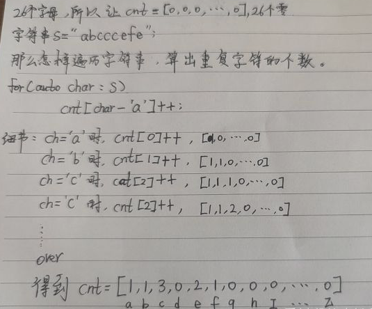

# 常用函数总结 cnt \[ ch-‘a‘ ]

## 力扣 字符串 常用函数总结 cnt \[ ch-‘a‘ ]++ 位运算 string转int ，char 转int <a href="#articlecontentid" id="articlecontentid"></a>

```cpp
string s;
char ch=s[0];
vector<char> s1;
1.验证字符串是否为空，求字符串长度
	s.empty();
	s.length();
	s.size();
2.
	isalnum(ch) //检测一个字符是否是字母或者十进制数字。
	isalpha(ch) //仅仅检测一个字符是否是字母 
	isdigit(ch) //仅仅检测一个字符是否是十进制数字
	tolower(ch)//把字母字符转换成小写，非字母字符不做出处理
	islower(ch);//判断是否为小写字母
	isupper(ch);//判断是否为大写字母
5.判断字符是否为空字符
	isspace();//返回布尔型变量
6.交换字符串数组的元素
	swap(s1[i],s1[n-i-1]);
7.翻转字符串
	reverse(s.begin()+i,s.begin()+a);
8.插入和删除字符串中的元素
	s1.insert(pos,s2);//在字符串s1的第pos个位置前 插入字符串s2
	s1.insert(pos,s2,begin,end);//在字符串s1的第pos个位置后面 插入字符串s2的从begin开始到end的前一个字符结束的子串
	s1.insert(pos,n,c)//在字符串s1的第pos个位置前 插入n个字符c
	
	s.erase(pos)//删除字符串s从第pos个字符开始之后所有的字符（包括第pos个）
	s.erase(pos,n)//删除字符串s从第pos个字符开始的n个字符	
9.append 函数添加元素，非常的好用！！
	str1.append(str2)//在字符串str1后添加字符串str2，用函数append实现。
	str1.append("abcdefg")//可以使用字符串变量，也可以直接使用字符串。
	str1.append("abcdefg").append("abcdefg").append("abcdefg")//字符串后，还可以用append函数，添加多个字符串。
	str1.append(str2,2,2)//用append函数，添加字符串中的指定字符。第二个字符后面的连个字符   比如：good  morning  --->  goodrn
	str1.append(6,"!")//使用append函数，还可以输入指定数量的字符。  添加六个感叹号
10.字符串的拼接
	string ans;
    for (int i = 0; i < 10; ++i) {
            ans += char(i + '0');
    }
11.查找函数
string str1="abefcdgcdfghcd";
int pos=str1.find("cd"); //pos =  4;
12.截取字符串函数，左闭右开
const string tmp = pattern.substr(0, 5);


	if(s.find(s[i])==s.rfind(s[i]))return i; //find()正向查找元素，rfind()逆向查找元素，返回元素得下标	
```

### 1. cnt \[ ch-‘a’ ]++ 遍历找出字符串的每个字符的重复的个数！

```cpp
string s = "abcccfg";
vector<int> cnt(26, 0);
for (char ch : s) {
	cnt[ch - 'a']++;
	//cnt[ch - 'a']++;
}
for (int i = 0; i < cnt.size(); i++)
{
	cout << cnt[i]  ;
}
```

<figure><figcaption></figcaption></figure>

### 2. 字符串也可以加减乘除

将字符串s中每个字符的ASCII码的值求和，得到A1; 对字符串t同样的方法得到A2。两者的差值 A1- A2。即代表了被添加的字符。

```cpp
string s = "abcde";
string t = "abcfde";
int as = 0, at = 0;
for (char ch : s) {
	as += ch;
}
for (char ch : t) {
	at += ch;
}
cout << char(102) <<endl;
cout << char(at-as) << endl;
```

### 3. 位运算

位运算找出多出来的那个字符

1. 任何数是和0的异或结果都是原来的数
2. 任何数和其自身做异或运算，结果都是0
3. 异或运算满足交换律和结合律

### 4. 字符转整数，string转int ，char 转int

```cpp
   string temp = "2359"; //temp = "2359";
    char x1 = temp[0] - '0';  // x1=2  将字符串的第一个字符转换成整数
    cout << "char x1不加上1 " << x1 << endl; //这样直接打印没有？？？？？？？？？？？？
    cout << "char x1加上1  " << x1 + 1 << endl;//加上计算，就可以显示？？？？？？？
    
    int x2 = temp[0] - '0';
    cout << "int x1不加上1 " << x2 << endl; //有
    cout << "int x1加上1  " << x2 + 1 << endl;//有

    int x3 = atoi(temp.c_str());  // x3=2359  atoi是转换char为int的函数，temp.c_str()功能见下面
    cout << "atoi下的x3 " << x3 << endl;

    cout << "测试 atoi 和 c_str()" << endl;
    const char* s = "1234";
    string str("5678");
    int intS = atoi(s);  //可以的，atoi将字符串换成数字

    //int intStr = atoi(str); //此写法会报错，需先将string转成char*
    int intStr = atoi(str.c_str()); //很明显，c_str()函数就是将string转换成const char * 类型的函数
    cout << "char* 转int: " << intS << endl;
    cout << "string 转int: " << intStr << endl;

/*
char xl不加上1
char xl加上1 3
int x1不加上1 2
int x1加上1 3
atoi下的x3 2359
测试atoi 和c_str()
char*转int:1234
string 转int: 5678
*/
```

### 5.char转int，int转char

```cpp
char c = '0';
 
int i1 = c;                    // 48
int i2 = c - 0;                // 48
int i3 = c - '0';              // 0
int i4 = c + '0';              // 96


int i = 5;
char c1 = i;                  // 越界
char c2 = i - 0;              // 越界
char c3 = i - '0';            // 越界
char c4 = i + '0';            // 5

//大于9的数字怎么转换
int num =45;
auto x1= 45 % 10 + '0';  // x1 = 5
num /=10;  // num=4;
auto x2= 45 % 10 + '0';  // x2 = 4

```

